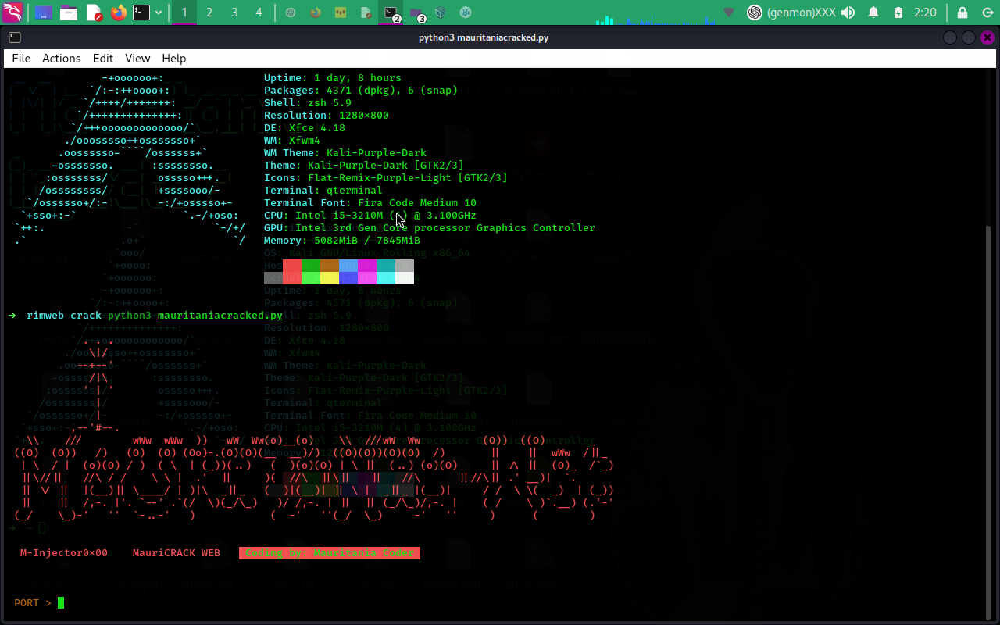

# M-Injector0x00 - Mauritania Coder

## Description
M-Injector0x00 is a Python script designed to perform "flood" attacks on specific servers using multiple threads.

## Installation
1. Make sure you have Python 3 installed on your computer.
2. Install the required libraries using the following command:

pip install colorama tqdm

## Usage
1. Run the script using Python 3:

python3 mauritaniacracked.py

2. Enter the attack information, such as the port number, IP address, and the number of threads.
3. The attack will start automatically.

## Notes
- Use this tool with caution. Attacking systems or networks without permission may be illegal.
- Ensure you have authorization to conduct security testing on the target systems.

## Author
- Mauritania Coder
- GitHub: [github.com/mauritaniacoder](https://github.com/mauritaniacoder)

## License
This project is licensed under the MIT License - see the [LICENSE](LICENSE) file for details.

